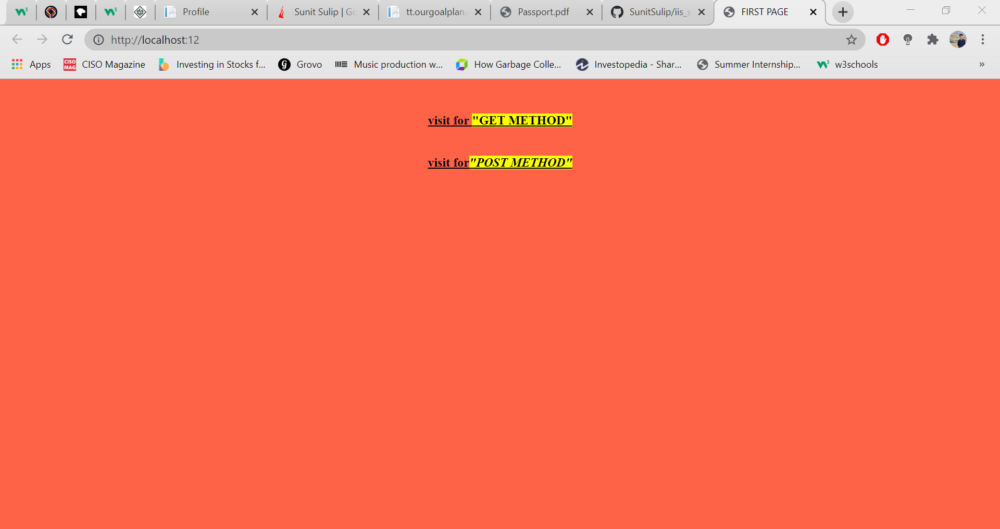
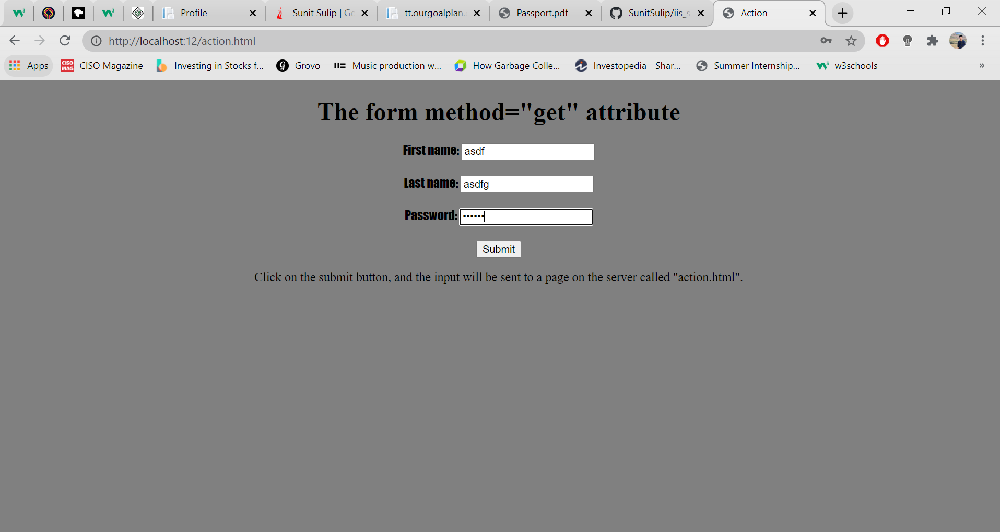
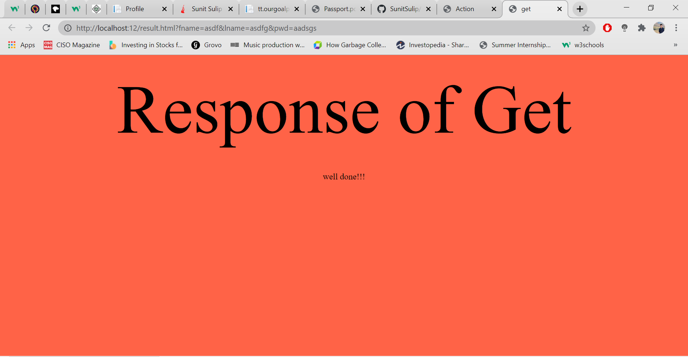
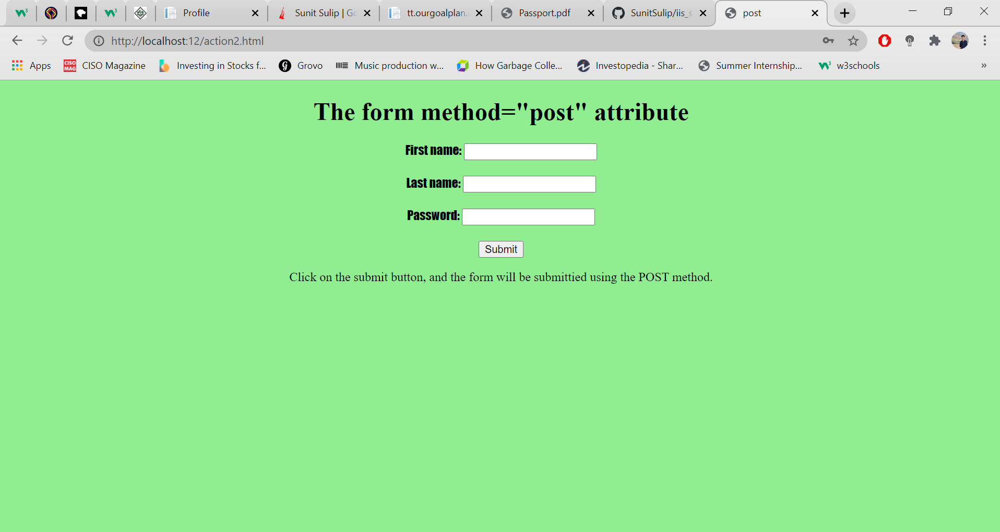

# iis_server

The iis server page website name is **first**
  
 -> iis server page
 
 
 -> the first web page with two links one is for get method and another one is for post method
 
 
 -> get method form 
 

 -> and its response
 
 
 -> post method form
 

 -> and its response
 the post shows error as it can handle only dynamic data not static data
  

 
